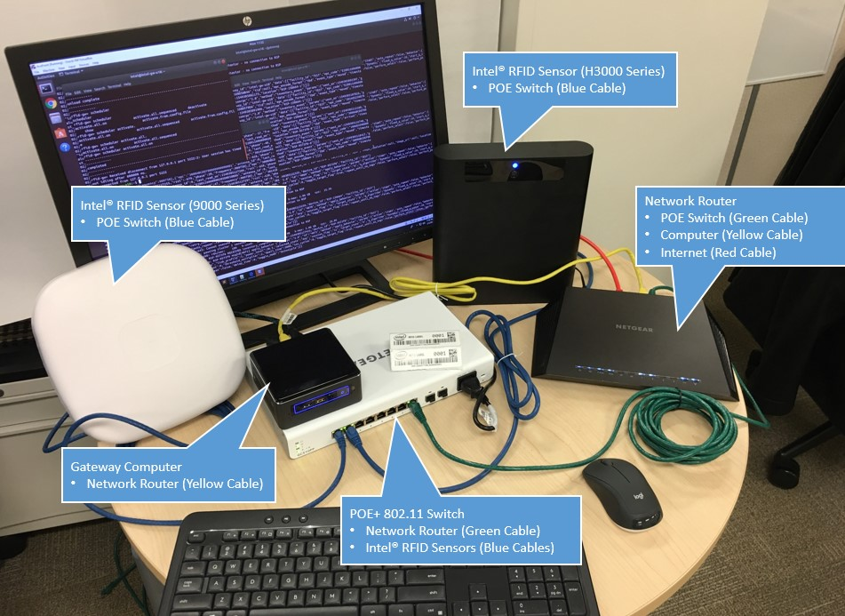
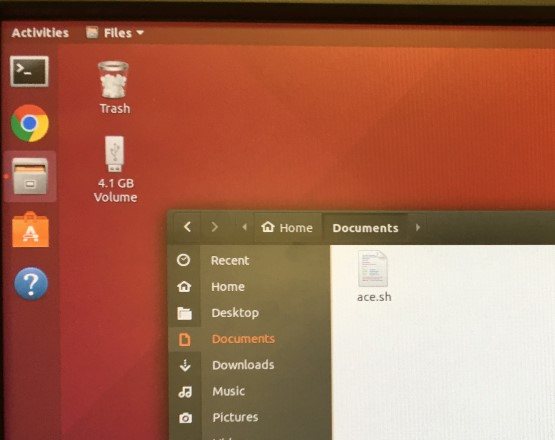
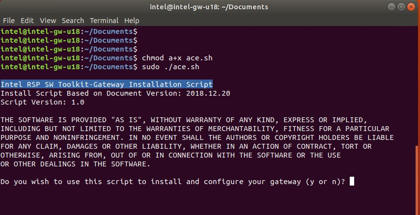

**Installing and Configuring the Intel RSP SW Toolkit-Gateway (Ace Point)**

Version History:
- Based on [Intel RSP SW Toolkit-Gateway Document Revision:  2018.12.20](338443-001_Intel-RSP-SW-Toolkit-Gateway.pdf) 

Pre-Requisites:

- Hardware:
  - 1 or more [Intel® RFID Sensor](https://software.intel.com/en-us/retail/rfid-sensor-platform)
  - Gateway Computer:  CPU: Intel®Core© i7, 8MB Cache, Intel®vPro, Intel®AMT Tech., RAM: 16 GB min, SDD: 80 GB min
  - Network router
  - POE+ 802.11 Switch (IEEE 802.3af, 802.3at, Cisco UPOE)
  - RFID Tag(s)  EPC UHF RFID Class 1 Gen 2 (ISO 18000-6C)
  - Cat 5 or greater Ethernet cables
  - Monitor, keyboard, mouse and optional USB drive (to transfer the install script to the gateway computer)
- Operating System:  Fresh installation of Ubuntu on the gateway computer.  This install script assumes Ubuntu 18.04.1
- Network:  Internet access required.

Directions:

| **Step** | **Description/Commands** | **Illustration** |
| --- | --- | --- |
| 1. | Set up and power your hardware.  Make sure you have an internet connection (no proxy) and a fresh installation of Ubuntu 18.04.1 on the gateway computer. ||
| 2. | Log into your gateway computer.  Copy the [install script](ace.sh) to a directory.||
| 3. | Open the terminal application on the gateway computer.  Navigate to the directory where you copied the install script.  Make the script executable and run it as sudo:  $ **`sudo chmod a+x ace.sh`** $ **`sudo ./ace.sh`**  Follow the installation instructions. ||
| 4. | Profit |   |

